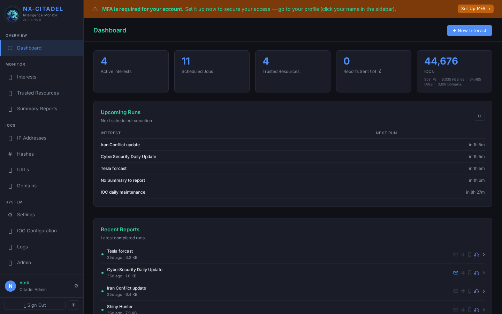
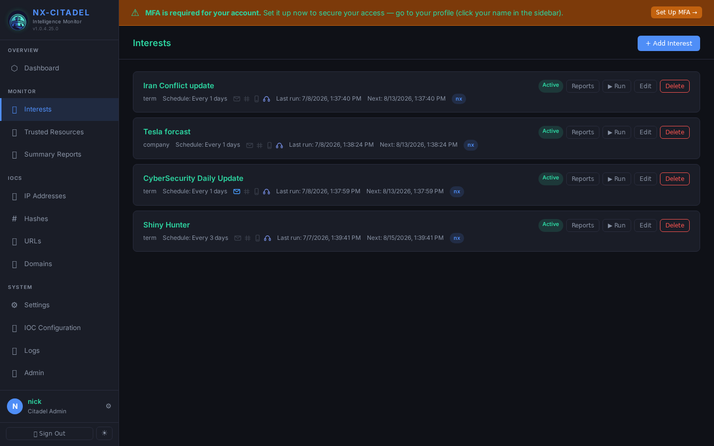
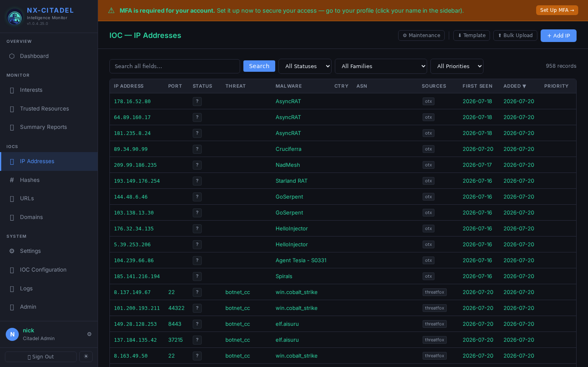
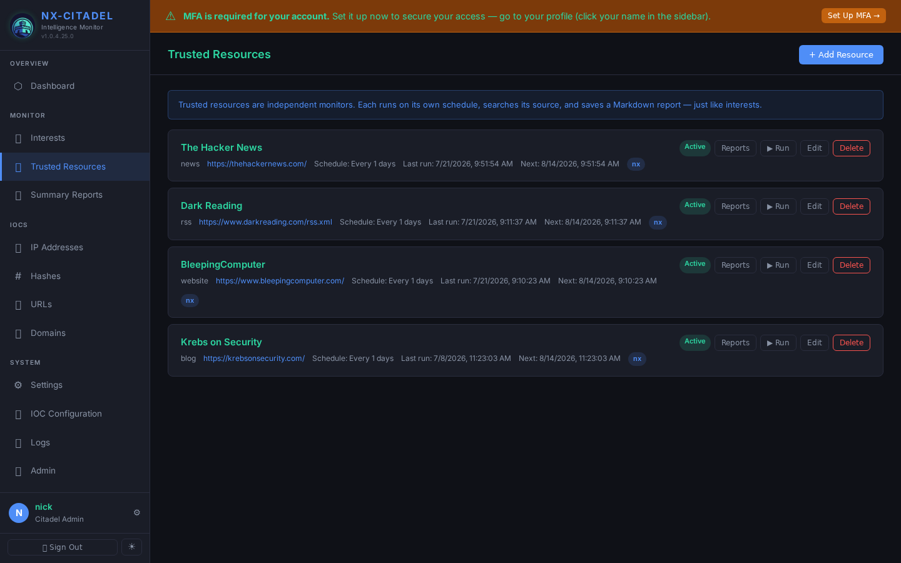

## Screenshots






# Nx-Citadel

**Self-hosted intelligence monitoring platform.** Track topics, people, technologies, and trusted sources — powered by AI-driven search, summarization, and delivery.

Nx-Citadel runs web searches on a schedule, feeds results to an LLM (Anthropic Claude), generates executive summaries, and delivers them via email, Slack, SMS, or Discord. It also maintains a database of Indicators of Compromise (IOCs) pulled from public threat-intel feeds.

> **Database-free.** All data stored as markdown files with YAML frontmatter. No SQL, no migrations, no external services required beyond the LLM API.

---

## Features

- **Interest monitoring** — Define topics (people, companies, tech, events, custom terms). Each runs on its own schedule, searches the web, and produces an AI summary report.
- **Trusted resource monitors** — Point at any URL (website, RSS feed, X/Twitter profile). The AI extracts and structures stories from the past 48 hours using a configurable prompt.
- **Executive summary reports** — Synthesize across multiple interest reports into cross-topic briefs, on their own schedule.
- **IOC tracking** — Automated daily ingestion from Feodo Tracker, URLhaus, MalwareBazaar, and OpenPhish. Bulk CSV upload with strict validation.
- **Multi-channel delivery** — Email (SMTP/Gmail), Slack webhook, SMS (Twilio), Discord webhook. Per-interest configuration.
- **Role-based access** — user / manager / admin roles with session auth and TOTP MFA (enforced for manager/admin on first login).
- **Full backup & restore** — ZIP-based full and granular backups through the UI.
- **Self-updating** — One-click update via SSE stream, preserving all user data.
- **Dark/light theme** — Dark default, toggle persisted to localStorage.

---

## Quick Start

### Prerequisites

- **Python 3.10+** on Linux
- **Anthropic API key** (for Claude LLM)
- Optional: SMTP details, Twilio account, Slack/Discord webhooks, Brave Search or SerpAPI keys

### Run locally

```bash
# 1. Clone and create virtual environment
python3 -m venv .venv
.venv/bin/pip install -r requirements.txt

# 2. Start the server (port 8000)
python run.py

# 3. Open http://localhost:8000
#    Default login: admin / admin
```

### Run as a background service

```bash
# Development (with PID tracking)
bash StartCitadel.sh

# Stop
bash StopCitadel.sh

# Production (systemd)
sudo cp citadel.service /etc/systemd/system/
sudo systemctl enable --now citadel
```

### Install on a server

```bash
curl -fsSL https://www.antonizick.com/nxcitadel/get.sh | sudo bash
```

Options: `--port 9000`, `--dir /opt/nxcitadel`, `--user nxcitadel`

---

## Architecture

```
┌─────────────────────────────────────────────────────────────────────────────┐
│                          CLIENT (Browser)                                  │
│          ┌─────────────────────────────────────────────────────────┐        │
│          │  SPA (index.html + app.js + main.css)                    │        │
│          │  • Tabbed navigation (Dashboard / Interests / Resources  │        │
│          │    / Summary Reports / IOCs / Settings / Admin / Logs)   │        │
│          │  • Axios → /api/*  • Auth via session cookies            │        │
│          │  • Theme toggle (dark/light, localStorage)               │        │
│          │  • SSE tail (admin self-update stream)                   │        │
│          └─────────────────────────────────────────────────────────┘        │
└────────────────────────────────┬────────────────────────────────────────────┘
                                 │ HTTPS (behind reverse proxy)
                                 ▼
┌─────────────────────────────────────────────────────────────────────────────┐
│                     NX-CITADEL APPLICATION SERVER                           │
│                  FastAPI + uvicorn :8000  (0.0.0.0)                        │
│                                                                             │
│  ┌─────────────────────────────────────────────────────────────────────┐    │
│  │                    Lifespan (startup/shutdown)                      │    │
│  │  • setup_logging()     • _seed_admin()     • APScheduler start     │    │
│  │  • IOC maintenance cron (02:00 UTC)  • IOC collection cron (03:00) │    │
│  │  • Per-interest / per-resource / per-summary schedule reload        │    │
│  └─────────────────────────────────────────────────────────────────────┘    │
│                                                                             │
│  ┌──────────┐  ┌──────────┐  ┌──────────┐  ┌──────────┐  ┌──────────┐   │
│  │ auth     │  │interests │  │resources │  │summary   │  │ iocs     │   │
│  │_router   │  │ (router) │  │ (router) │  │_reports  │  │ (router) │   │
│  │          │  │          │  │          │  │ (router) │  │          │   │
│  │ /login   │  │ CRUD     │  │ CRUD     │  │ CRUD     │  │ CRUD     │   │
│  │ /api/    │  │ run      │  │ run      │  │ run      │  │ bulk CSV │   │
│  │ auth/*   │  │ reports  │  │ reports  │  │ reports  │  │ config   │   │
│  └──────────┘  └──────────┘  └──────────┘  └──────────┘  └──────────┘   │
│                                                                             │
│  ┌──────────┐  ┌──────────┐  ┌──────────┐  ┌──────────┐  ┌──────────┐   │
│  │ users    │  │ settings │  │  logs    │  │ admin    │  │ioc_config │   │
│  │ (router) │  │ (router) │  │ (router) │  │ (router) │  │ (router) │   │
│  │          │  │          │  │          │  │          │  │          │   │
│  │ CRUD     │  │ CRUD     │  │ tail     │  │ backup   │  │ source   │   │
│  │ MFA reset│  │ test LLM │  │ archive  │  │ restore  │  │ sync     │   │
│  │          │  │ test SMS │  │          │  │ build-pkg│  │ status   │   │
│  │          │  │ test email│  │          │  │ reset    │  │          │   │
│  │          │  │ test disc│  │          │  │          │  │          │   │
│  └──────────┘  └──────────┘  └──────────┘  └──────────┘  └──────────┘   │
│                                                                             │
│  ┌─────────────────────────────────────────────────────────────────────┐    │
│  │                      Auth Middleware (main.py)                      │    │
│  │  • Session cookie validation (12h TTL)  • bcrypt password check     │    │
│  │  • TOTP MFA enforcement (manager/admin)  • bypass /login, /static   │    │
│  └─────────────────────────────────────────────────────────────────────┘    │
└─────────────────────────────────────────────────────────────────────────────┘
         │                    │                     │
         ▼                    ▼                     ▼
┌─────────────────┐ ┌────────────────┐ ┌─────────────────────────────────┐
│     SERVICES     │ │     SERVICES     │ │       SERVICES                │
├───────────────┤ ├───────────────┤ ├──────────────────────────────┤
│ ai_service      │ │ search_service  │ │ scheduler_service             │
│                 │ │                 │ │                               │
│ • summarize_    │ │ • search_multi  │ │ • run_interest()              │
│   results()     │ │ • search_web()  │ │ • run_resource()              │
│ • summarize_    │ │ • search_trusted│ │ • run_summary_report()        │
│   resource()    │ │   _resource()   │ │ • _build_trigger()            │
│                 │ │ (DDG/Brave/Serp)│ │ • reload_all_schedules()      │
│ SYSTEM_PROMPT:  │ │                 │ │                               │
│ "use only       │ │ OUTPUT CHANNELS:│ │ ioc_collector                 │
│  provided       │ │ deliver_outputs │ │                               │
│  results, cite  │ │ • email (aiosmtp)│ │ • Feodo Tracker              │
│  every claim"   │ │ • slack webhook │ │ • URLhaus                     │
└───────┬────────┘ │ • sms (Twilio)  │ │ • MalwareBazaar               │
         │         │ • discord wh    │ │ • OpenPhish                    │
         │         └────────┬────────┘ └────────────────┬────────────┘
         │                  │                          │
         ▼                  ▼                          ▼
┌──────────────────────────────────────────────────────────────────────────────────┐
│                            OUTPUT LAYER                                   │
│                                                                                │
│  ┌─────────────────────────────────────────────────────────────────────┐  │
│  │ output_service / summary_service                                       │  │
│  │                                                                        │  │
│  │ deliver_outputs():                                                     │  │
│  │   1. save report (.md → data/reports/<id>/)                           │  │
│  │   2. deliver to channels (email/slack/sms/discord)                    │  │
│  │   3. enrich with recent resource reports (data/resource_reports/)      │  │
│  └─────────────────────────────────────────────────────────────────────┘  │
│                                                                                │
│  ┌─────────────────────────────────────────────────────────────────────┐  │
│  │ logger_service                                                         │  │
│  │ • setup_logging() → logs/citadel.log (daily rotation)                 │  │
│  │ • log_user_action()                                                   │  │
│  └─────────────────────────────────────────────────────────────────────┘  │
└──────────────────────────────────────────────────────────────────────────────────┘
         │
         ▼
┌──────────────────────────────────────────────────────────────────────────────────┐
│                            STORAGE LAYER                                      │
│                    (markdown files with YAML frontmatter — no DB)            │
├──────────────────────────────────────────────────────────────────────────────────┤
│                                                                                │
│  markdown_store.py           ──→  Generic CRUD for .md + frontmatter          │
│  ioc_store.py                ──→  IOC-specific + dedup + maintenance          │
│  user_store.py               ──→  User CRUD                                   │
│                                                                                │
│  ┌─────────────────────────────────────────────────────────────────────┐      │
│  │ data/interests/       ──→  <uuid>.md (watch topic defs)             │      │
│  │ data/reports/<id>/    ──→  <timestamp>.md (generated reports)       │      │
│  │ data/resources/       ──→  <uuid>.md (trusted resource monitors)    │      │
│  │ data/resource_reports/<id>/ ──→ <timestamp>.md (resource reports)   │      │
│  │ data/summary_reports/<id>/  ──→ defs + generated reports            │      │
│  │ data/iocs/            ──→  ips.md, domains.md, urls.md, hashes.md   │      │
│  │ data/users/           ──→  User accounts (bcrypt)                   │      │
│  │ data/config/          ──→  settings.yaml, ioc_sources.yaml,         │      │
│  │                           ioc_sync_status.yaml                      │      │
│  │ logs/                 ──→  citadel.log + daily archives (.gz)       │      │
│  └─────────────────────────────────────────────────────────────────────┘      │
└────────────────────────────────────────────────────────────────────────────────┘

┌──────────────────────────────────────────────────────────────────────────────────┐
│                            EXTERNAL INTEGRATIONS                              │
├─────────────────────┬──────────────┬──────────────┬─────────────────┬────────────┤
│  Anthropic   │  DuckDuckGo  │  aiosmtplib  │  Twilio      │  Discord        │
│  Claude API  │  Brave API   │  (email)     │  (SMS)       │  webhook        │
│              │  SerpAPI     │              │              │                 │
│  • AI summarization            │              │              │                 │
│  • SYSTEM_PROMPT               │              │              │                 │
│    enforcement                 │              │              │                 │
└───────────────┴──────────────┴──────────────┴──────────────┴───────────────┘
```

**Key data flows:**

1. **Interest run pipeline**: `scheduler_service.run_interest()` → `search_service.search_multi()` (DDG/Brave/SerpAPI) → `ai_service.summarize_results()` (Anthropic Claude) → `output_service.deliver_outputs()` → save report + optional delivery channels (email/slack/sms/discord). Summary is enriched with recent trusted resource reports from `data/resource_reports/`.

2. **Resource monitor pipeline**: `run_resource()` → render prompt with `[SOURCE]` substitution → `search_multi()` → `summarize_resource()` → `deliver_resource_outputs()` → save to `data/resource_reports/<id>/`.

3. **Executive summary pipeline**: `run_summary_report()` → collects all interest reports → LLM synthesis → delivery via configured channels.

4. **IOC pipeline**: Scheduled collection (03:00 UTC daily) pulls from Feodo Tracker, URLhaus, MalwareBazaar, OpenPhish → `ioc_store` with dedup → daily maintenance (02:00 UTC) prunes expired/low-priority entries.

5. **Auth flow**: Session cookies (12h TTL) → bcrypt password + TOTP MFA (enforced for manager/admin) → middleware in `main.py` protects all `/api/*` except auth paths.

### Directory structure

```
nxcitadel/
├── app/                        # Application code
│   ├── main.py                 # FastAPI entry point, auth middleware
│   ├── auth.py                 # Sessions, bcrypt, TOTP
│   ├── models.py               # Pydantic models
│   ├── config.py               # settings.yaml loader
│   ├── routers/                # API endpoints (CRUD, run, reports)
│   ├── services/               # Business logic (AI, search, scheduler, IOC)
│   └── storage/                # Markdown CRUD layer
├── data/                       # All user data (markdown + YAML)
│   ├── interests/              # Watch topic definitions
│   ├── resources/              # Trusted resource monitor definitions
│   ├── reports/                # Generated interest reports
│   ├── resource_reports/       # Generated resource monitor reports
│   ├── summary_reports/        # Summary report definitions + generated reports
│   ├── iocs/                   # IOC data (ips, domains, urls, hashes)
│   ├── users/                  # User accounts
│   └── config/                 # settings.yaml, ioc_sources.yaml
├── templates/index.html        # SPA shell (Jinja2)
├── static/                     # CSS + JS + assets
├── deploy/                     # Install script, build scripts, packages
├── logs/                       # Application logs (daily rotation)
├── run.py                      # Dev entry point
├── requirements.txt            # Python dependencies
└── citadel.service             # Systemd unit file
```

---

## Configuration

All settings live in `data/config/settings.yaml`. Create it via the Settings UI or manually:

```yaml
llm:
  provider: anthropic
  api_key: sk-ant-...
  model: claude-sonnet-4-6

search:
  provider: duckduckgo          # duckduckgo | brave | serpapi
  max_results: 10
  brave_api_key: ""
  serpapi_key: ""

email:
  smtp_host: smtp.gmail.com
  smtp_port: 587
  smtp_user: you@gmail.com
  smtp_password: your-app-password
  from_address: you@gmail.com
  use_tls: true

slack:
  default_webhook: ""

discord:
  default_webhook: ""

sms:
  provider: twilio
  account_sid: ""
  auth_token: ""
  from_number: ""

system_state: production        # set to "dev" to suppress scheduled LLM calls
```

### Dev mode

During active development, set `system_state: dev` to prevent all scheduled runs from firing. Manual runs (UI "Run" button) still work. Toggle via the API:

```bash
POST /api/admin/system-state  {"system_state": "dev"}
GET  /api/admin/system-state
```

---

## Scheduling

Each interest, resource, and summary report has its own schedule:

```yaml
schedule:
  type: interval          # interval | weekly | cron | manual
  interval_value: 1
  interval_unit: days     # minutes | hours | days | weeks
  run_time: "20:00"       # HH:MM UTC (weekly type)
  days_of_week: [0,1,2]   # 0=Mon … 6=Sun (weekly type)
  cron_expression: "0 20 * * *"  # (cron type)
```

System jobs (always active):
- **IOC maintenance** — 02:00 UTC daily, prunes expired entries
- **IOC collection** — 03:00 UTC daily, pulls all enabled feeds

---

## API

The full API is documented via OpenAPI at `http://localhost:8000/docs` when running. All endpoints require session authentication except `/login`, `/health`, `/static/*`, and `/api/auth/*`.

| Router | Prefix | Purpose |
|---|---|---|
| `auth_router` | (none) | Login page, MFA, logout, `/api/auth/me` |
| `interests` | `/api/interests` | CRUD, run, reports, activity |
| `resources` | `/api/resources` | CRUD, run, reports |
| `summary_reports` | `/api/summary-reports` | CRUD, run, report files |
| `iocs` | `/api/iocs` | IOC CRUD, counts, bulk CSV upload |
| `ioc_config` | `/api/ioc-config` | Feed source config, sync status, manual pull |
| `users` | `/api/users` | User CRUD, MFA reset (admin) |
| `settings` | `/api/settings` | Settings CRUD, test endpoints (LLM, email, SMS, Discord) |
| `logs` | `/api/logs` | Recent log lines, archive listing |
| `admin` | `/api/admin` | Backup/restore, build-package, self-update, factory reset |

---

## Development

```bash
# Create venv
python3 -m venv .venv
.venv/bin/pip install -r requirements.txt

# Start (foreground, no reload)
python run.py

# Start (background, with PID tracking)
bash StartCitadel.sh

# Stop
bash StopCitadel.sh

# View logs
tail -f logs/citadel.log
```

There is no test suite, linter, type checker, or formatter. Verification is manual — start the server and exercise the UI or API.

---

## Deployment

### Build a package

```bash
bash deploy/build_package.sh
# → deploy/nxcitadel-<timestamp>.tar.gz
# → deploy/nxcitadel-latest.tar.gz (symlink)
```

Or via the UI: Admin panel → **Build Package** → **Download Package**.

### One-line install on any Linux server

```bash
curl -fsSL https://www.antonizick.com/nxcitadel/get.sh | sudo bash
```

### Self-update (from within the app)

Admin panel → **Update** — downloads the latest package, backs up data, extracts via rsync, reinstalls dependencies, and restarts the service. All streamed over SSE.

### Production recommendations

- Run behind a reverse proxy (nginx, Caddy) for HTTPS termination
- No built-in rate limiting — add at the proxy layer
- Change the default `admin / admin` credentials immediately
- Enable MFA on all accounts

---

## Security

- Session cookies with 12-hour TTL
- Passwords hashed with bcrypt
- TOTP MFA enforced for manager/admin roles (5-minute pending challenge expiry)
- Admins can be flagged `mfa_exempt`
- Auth middleware runs on all paths except login, health, static, and auth API
- Default admin seeded on first start — **change password immediately**

---

## License

See the repository for license details.
